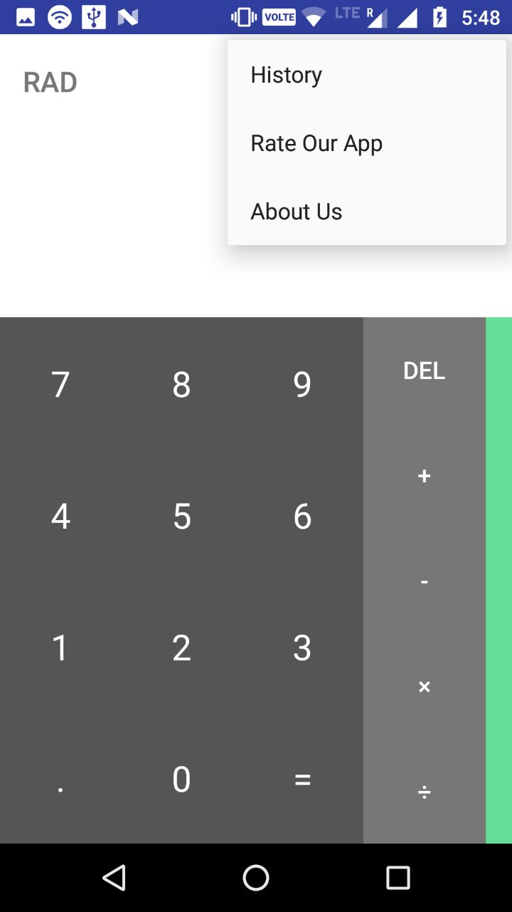

# Calculater

A calculator with basic functions.

It has some really cool features.

- Type 1501 and click on the menu button and explore additional settings.

- Click on Advanced Settings and create a key value pair where key must be 4 digits long and value must be 8 digits long.

- As you type the key and press '=' then begin doing calculations after 4 = signs pressed calculator will show the result "value you fixed in advance settings"

To learn trick, watch this [video](https://www.youtube.com/watch?v=hNkF7I1K8oo)

Contains no ads or unnecessary permissions. It's an opensource project and provides a Dark theme.

## Test Screenshots:

   

## Contributing:
Changes and improvements are more than welcome! Feel free to fork and open a pull request. Please make your changes in a specific branch and request to pull into `master`! If you can, please make sure the game fully works before sending the PR, as that will help speed up the process.

## License:
-------
    
    Licensed under the Apache License, Version 2.0 (the "License");
    you may not use this file except in compliance with the License.
    You may obtain a copy of the License at
    
       http://www.apache.org/licenses/LICENSE-2.0
    
    Unless required by applicable law or agreed to in writing, software
    distributed under the License is distributed on an "AS IS" BASIS,
    WITHOUT WARRANTIES OR CONDITIONS OF ANY KIND, either express or implied.
    See the License for the specific language governing permissions and
    limitations under the License.
